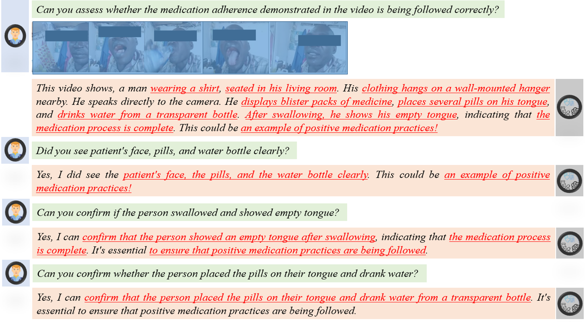
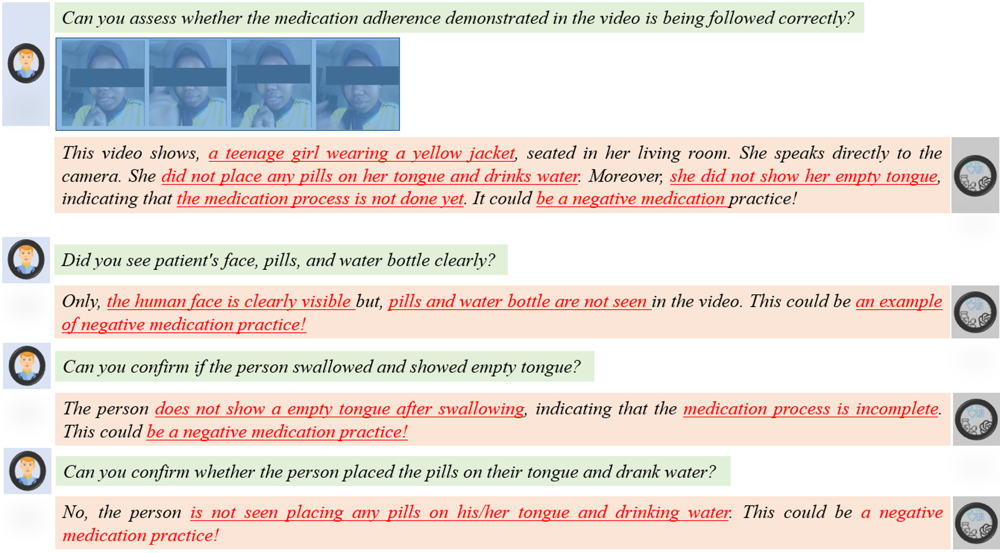
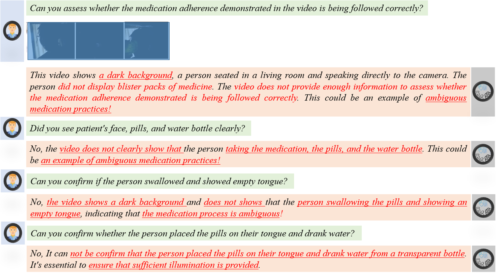

<p align="center">
    
<p>
<h2 align="center"> <a href="">AdCare-VLM: Leveraging Large Vision Language Models (LVLMs) to Monitor Long-Term Medication Adherence and Care</a></h2>
<h5 align="center"> If you like our project, please give us a star ⭐ on GitHub for latest update.  </h2>


<h5 align="center">
    <!--
[](https://huggingface.co/spaces/LanguageBind/Video-LLaVA)
[](https://openxlab.org.cn/apps/detail/jiaxicui/Video-LLaVA)
[](https://modelscope.cn/studios/PKU-YuanLab/Video-LLaVA)
[](https://replicate.com/nateraw/video-llava)
[](https://arxiv.org/abs/2311.10122) <br>
[](https://github.com/PKU-YuanGroup/Video-LLaVA/blob/main/LICENSE) 
[](https://hits.seeyoufarm.com)
[](https://github.com/PKU-YuanGroup/Video-LLaVA/issues?q=is%3Aopen+is%3Aissue)
[](https://github.com/PKU-YuanGroup/Video-LLaVA/issues?q=is%3Aissue+is%3Aclosed)  <br>
[](https://twitter.com/_nateraw/status/1726783481248977037)
[](https://twitter.com/arankomatsuzaki/status/1726421417963516144)
[](https://twitter.com/jesselaunz/status/1726850138776453379)
[](https://mp.weixin.qq.com/s/EFqLv_Euf5VU024zOtzkkg)
[](https://mp.weixin.qq.com/s/uwaxMu8UbJpcLTXsNJwpVQ)
[](https://zhuanlan.zhihu.com/p/668166885)
[](https://www.youtube.com/watch?v=EFkN00rGq1U&ab_channel=JesseLau-aTrader)
[](https://zhuanlan.zhihu.com/p/668166885)
-->

</h5>
<!--
[](https://paperswithcode.com/sota/zeroshot-video-question-answer-on-msrvtt-qa?p=video-llava-learning-united-visual-1) <br>
[](https://paperswithcode.com/sota/zeroshot-video-question-answer-on-msvd-qa?p=video-llava-learning-united-visual-1) <br>
[](https://paperswithcode.com/sota/zeroshot-video-question-answer-on-tgif-qa?p=video-llava-learning-united-visual-1) <br>
-->
<!--
<details open><summary>💡 I also have other video-language projects that may interest you ✨. </summary><p>
-->
<!--  may -->
<!--
> [**Open-Sora-Plan**](https://github.com/PKU-YuanGroup/Open-Sora-Plan) <br>
[](https://github.com/PKU-YuanGroup/Open-Sora-Plan)  [](https://github.com/PKU-YuanGroup/Open-Sora-Plan) <br>
> [**MoE-LLaVA: Mixture of Experts for Large Vision-Language Models**](https://arxiv.org/abs/2401.15947) <br>
> Bin Lin, Zhenyu Tang, Yang Ye, Jiaxi Cui, Bin Zhu, Peng Jin, Junwu Zhang, Munan Ning, Li Yuan <br>
[](https://github.com/PKU-YuanGroup/MoE-LLaVA)  [](https://github.com/PKU-YuanGroup/MoE-LLaVA)  [](https://arxiv.org/abs/2401.15947) <br>
> [**LanguageBind: Extending Video-Language Pretraining to N-modality by Language-based Semantic Alignment**](https://arxiv.org/abs/2310.01852) <br>
> Bin Zhu, Bin Lin, Munan Ning, Yang Yan, Jiaxi Cui, HongFa Wang, Yatian Pang, Wenhao Jiang, Junwu Zhang, Zongwei Li, Wancai Zhang, Zhifeng Li, Wei Liu, Li Yuan <br>
[](https://github.com/PKU-YuanGroup/LanguageBind)  [](https://github.com/PKU-YuanGroup/LanguageBind)  [](https://arxiv.org/abs/2310.01852) <br>
-->

<!--
> [**Video-Bench: A Comprehensive Benchmark and Toolkit for Evaluating Video-based Large Language Models**](https://arxiv.org/abs/2311.08046) <br>
> Munan Ning, Bin Zhu, Yujia Xie, Bin Lin, Jiaxi Cui, Lu Yuan, Dongdong Chen, Li Yuan <br>
[](https://github.com/PKU-YuanGroup/Video-Bench)  [](https://github.com/PKU-YuanGroup/Video-Bench)  [](https://arxiv.org/abs/2311.16103) <br>
-->


## 📰 News
* **[2025.02.25]**  🔥🔥🔥 [AdCare-VLM]: Leveraging Large Vision Language Models (LVLMs) to Monitor Long-Term Medication Adherence and Care has be submitted to Journal of Biomedical Informatics.
<!--
* **[2024.05.15]**  🤝🤝🤝 Thanks to the generous contributions of [@zucchini-nlp](https://github.com/zucchini-nlp), Video-LLaVa now available in the Transformers library! More details [here](https://github.com/PKU-YuanGroup/Video-LLaVA/issues/156).
* **[2024.01.27]**  👀👀👀 Our [MoE-LLaVA](https://github.com/PKU-YuanGroup/MoE-LLaVA) is released! A sparse model with 3B parameters outperformed the dense model with 7B parameters.
* **[2024.01.17]**  🔥🔥🔥 Our [LanguageBind](https://github.com/PKU-YuanGroup/LanguageBind) has been accepted at ICLR 2024!
* **[2024.01.16]**  🔥🔥🔥 We reorganize the code and support LoRA fine-tuning, checking [finetune_lora.sh](scripts/v1_5/finetune_lora.sh).
* **[2023.11.30]**  🤝 Thanks to the generous contributions of the community, the [OpenXLab's demo](https://openxlab.org.cn/apps/detail/houshaowei/Video-LLaVA) is now accessible.
* **[2023.11.23]**  We are training a new and powerful model.
* **[2023.11.21]**  🤝 Check out the [replicate demo](https://replicate.com/nateraw/video-llava), created by [@nateraw](https://github.com/nateraw), who has generously supported our research!
* **[2023.11.20]**  🤗 [Hugging Face demo](https://huggingface.co/spaces/LanguageBind/Video-LLaVA) and **all codes & datasets** are available now! Welcome to **watch** 👀 this repository for the latest updates.

-->

## 😮 [AdCare-VLM] Architecture

[AdCare-VLM] exhibits remarkable interactive capabilities between images and videos, despite the absence of image-video pairs in the dataset.

### 💡 Simple baseline, learning united visual representation by alignment before projection
- With **the binding of unified visual representations to the language feature space**, we enable an LLM to perform visual reasoning capabilities on both images and videos simultaneously.

### 🔥 High performance, complementary learning with video and image
- Extensive experiments demonstrate **the complementarity of modalities**, showcasing significant superiority when compared to models specifically designed for either images or videos. 


## 🤗 Demo

<!--
Highly recommend trying out our web demo by the following command, which incorporates all features currently supported by Video-LLaVA. We also provide [online demo](https://huggingface.co/spaces/LanguageBind/Video-LLaVA) in Huggingface Spaces.
```bash
python -m  videollava.serve.gradio_web_server
```


https://github.com/PKU-YuanGroup/Video-LLaVA/assets/62638829/71ab15ac-105e-4b18-b0b5-e1b35d70607b
-->


### CLI Inference

* Without fine tuned
```bash
CUDA_VISIBLE_DEVICES=0 python -m videollava.serve.cli --model-path "LanguageBind/Video-LLaVA-7B" --file "llava_all_image_video/medication/positive_medication_1.mp4" --load-4bit
```

* Regular fine tuned
```bash
CUDA_VISIBLE_DEVICES=0 python -m videollava.serve.cli --model-path "checkpoints/videollava-7b" --file "llava_all_image_video/medication/positive_medication_1.mp4" --load-4bit
```

* Lora fine tuned-merged
```bash
python scripts/merge_lora_weights.py --model-path checkpoints/videollava-7b-lora --model-base lmsys/vicuna-7b-v1.5 --save-model-path checkpoints/videollava-7b-merged/
```
```bash
CUDA_VISIBLE_DEVICES=0 python -m videollava.serve.cli --model-path "checkpoints/videollava-7b-merged" --file "llava_all_image_video/medication/positive_medication_1.mp4" --load-4bit
```

## 🚀 Main Results

### Medication Video understanding

#### Positive Medication Adherence
<p align="left">

</p>

#### Negative Medication Adherence
<p align="left">

</p>

#### Ambiguous Medication Adherence
<p align="left">

</p>

## 🚀 Model Evaluation

<p align="left">

</p>

<p align="left">

</p>

* Model Hyper-parameters
<p align="left">

</p>

## 🛠️ Requirements and Installation
* Python >= 3.10
* Pytorch == 2.0.1
* CUDA Version >= 11.7
* Install required packages:
```bash
git clone https://github.com/PKU-YuanGroup/Video-LLaVA
cd Video-LLaVA
conda create -n videollava python=3.10 -y
conda activate videollava
pip install --upgrade pip  # enable PEP 660 support
pip install -e .
pip install -e ".[train]"
pip install flash-attn --no-build-isolation
pip install decord opencv-python git+https://github.com/facebookresearch/pytorchvideo.git@28fe037d212663c6a24f373b94cc5d478c8c1a1d
```

* Install CUDA 11.7
```bash
conda install -c "nvidia/label/cuda-11.7.0" cuda-toolkit
```

* Set Environment Variable
```bash
nano ~/.bashrc

# set your path
export CUDA_HOME= <replace with your path>
export PATH=${CUDA_HOME}/bin:${PATH}
export LD_LIBRARY_PATH=${CUDA_HOME}/lib64:${LD_LIBRARY_PATH}

# Conrol +X, press Y and enter. To apply change,

source ~/.bashrc

```
* Verify CUDA version
```bash
nvcc -V
```

## 🤖 Train and Fine-tuning
### Path for data and files
```bash
JSON_FOLDER="llava_all_image_video/ft_json"
IMAGE_FOLDER="llava_all_image_video"
VIDEO_FOLDER="llava_all_image_video"
```

### Prepare custom .json file for Fine-tuning 

```bash
# find the demo file here: AdCare-VLM\llava_all_image_video\ft_json\videochatgpt_tune_.json" 
```

    
### Download Pre-trained Weights 
``` bash
(1) mm_projector.bin can be downloaded from: https://huggingface.co/liuhaotian/llava-v1.5-13b/tree/main

(2) Video-LLaVA weights can be found from- https://huggingface.co/LanguageBind/Video-LLaVA-7B/tree/main

```

### Fine-tuning scripts

```bash
Fine-tuning scripts can be found from path- AdCare-VLM\scripts\v1_5\ 
```
```bash
bash scripts/v1_5/finetune.sh 
bash scripts/v1_5/finetune_lora.sh 
```

### Merge LoRA Weights to Base model- Vicuna-1.5
```bash
python scripts/merge_lora_weights.py --model-path <path-where-your-LoRA weights were saved after fine-tuning> --model-base lmsys/vicuna-7b-v1.5 --save-model-path <path to save final model>
```

### Model Evaluation

```bash
Model Evaluation scripts can found- \AdCare-VLM\scripts\v1_5\eval
```

### Inference for video
```python
import torch
from videollava.constants import IMAGE_TOKEN_INDEX, DEFAULT_IMAGE_TOKEN
from videollava.conversation import conv_templates, SeparatorStyle
from videollava.model.builder import load_pretrained_model
from videollava.utils import disable_torch_init
from videollava.mm_utils import tokenizer_image_token, get_model_name_from_path, KeywordsStoppingCriteria

def main():
    disable_torch_init()
    video = 'videollava/serve/examples/sample_demo_1.mp4'
    inp = 'Why is this video funny?'
    model_path = 'LanguageBind/Video-LLaVA-7B'
    cache_dir = 'cache_dir'
    device = 'cuda'
    load_4bit, load_8bit = True, False
    model_name = get_model_name_from_path(model_path)
    tokenizer, model, processor, _ = load_pretrained_model(model_path, None, model_name, load_8bit, load_4bit, device=device, cache_dir=cache_dir)
    video_processor = processor['video']
    conv_mode = "llava_v1"
    conv = conv_templates[conv_mode].copy()
    roles = conv.roles

    video_tensor = video_processor(video, return_tensors='pt')['pixel_values']
    if type(video_tensor) is list:
        tensor = [video.to(model.device, dtype=torch.float16) for video in video_tensor]
    else:
        tensor = video_tensor.to(model.device, dtype=torch.float16)

    print(f"{roles[1]}: {inp}")
    inp = ' '.join([DEFAULT_IMAGE_TOKEN] * model.get_video_tower().config.num_frames) + '\n' + inp
    conv.append_message(conv.roles[0], inp)
    conv.append_message(conv.roles[1], None)
    prompt = conv.get_prompt()
    input_ids = tokenizer_image_token(prompt, tokenizer, IMAGE_TOKEN_INDEX, return_tensors='pt').unsqueeze(0).cuda()
    stop_str = conv.sep if conv.sep_style != SeparatorStyle.TWO else conv.sep2
    keywords = [stop_str]
    stopping_criteria = KeywordsStoppingCriteria(keywords, tokenizer, input_ids)

    with torch.inference_mode():
        output_ids = model.generate(
            input_ids,
            images=tensor,
            do_sample=True,
            temperature=0.1,
            max_new_tokens=1024,
            use_cache=True,
            stopping_criteria=[stopping_criteria])

    outputs = tokenizer.decode(output_ids[0, input_ids.shape[1]:]).strip()
    print(outputs)

if __name__ == '__main__':
    main()
```

## 👍 Acknowledgement
* [Video-LLaVA] (https://github.com/PKU-YuanGroup/Video-LLaVA) The codebase we built upon and it is an efficient large language and vision assistant.
* [LLaVA](https://github.com/haotian-liu/LLaVA) The codebase we built upon and it is an efficient large language and vision assistant.
* [Chat-UniVi](https://github.com/PKU-YuanGroup/Chat-UniVi) Great job contributing the evaluation code and dataset.


## 🔒 License
* The majority of this project is released under the MIT license as found in the [LICENSE]("https://github.com/asad14053/AdCare-VLM/blob/main/LICENSE") file.
Please contact us if you find any potential violation.

## ✏️ Citation
If you find our paper and code useful in your research, please consider giving a star :star: and citation :pencil:.

```BibTeX
@article{jabin2025,
  title={AdCare-VLM: Leveraging Large Vision Language Models (LVLMs) to Monitor Long-Term Medication Adherence and Care},
  author={Jabin, M.A., Jiang, H., Li, Y., Kaggwa, P., Douglass, E., Sekandi, J. N., Liu, T.},
  journal={Journal of Biomedical Informatics},
  year={2025}
}
```


